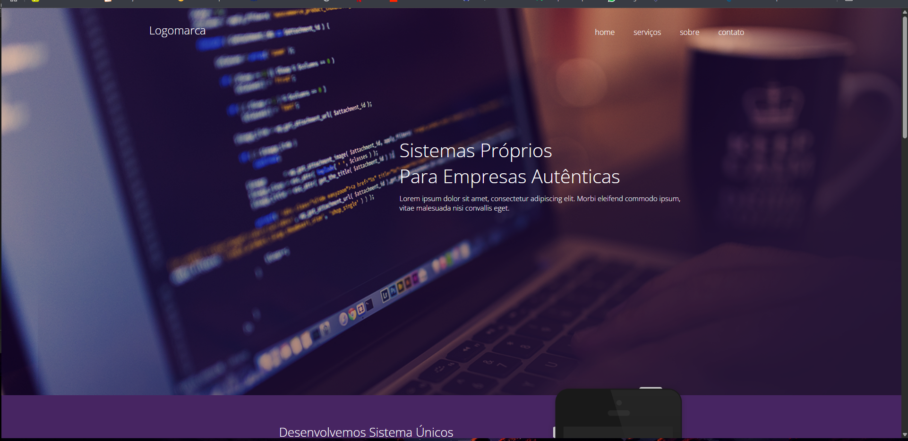

# 🚀 Landing Page Agência

Landing page desenvolvida para uma agência fictícia, com foco na apresentação de serviços.  
Projeto criado utilizando HTML5, CSS3 e JQuery, com layout moderno, responsivo e adaptado para diferentes tamanhos de tela.

---

## 🖥️ Tecnologias utilizadas:
- ✔️ HTML5
- ✔️ CSS3
- ✔️ JavaQuery

---

## 📸 Preview do projeto:
 

---

## 📂 Funcionalidades:
- 🔸 Design responsivo (mobile, tablet e desktop)
- 🔸 Layout moderno e clean
- 🔸 Seções para apresentação de serviços, sobre, contato e mais
- 🔸 Navegação simples e intuitiva

---

## ⚙️ Como visualizar este projeto:
1. Acesse https://devpedrohenrique25.github.io/Landing-Page-Agencia/
   ou
3. Clique no botão verde **"Code"** acima.
4. Selecione **"Download ZIP"** para baixar o projeto.
5. Abra o arquivo index.html.
